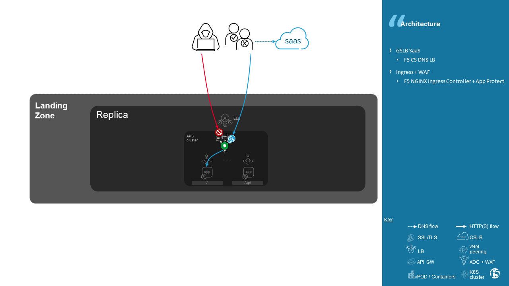
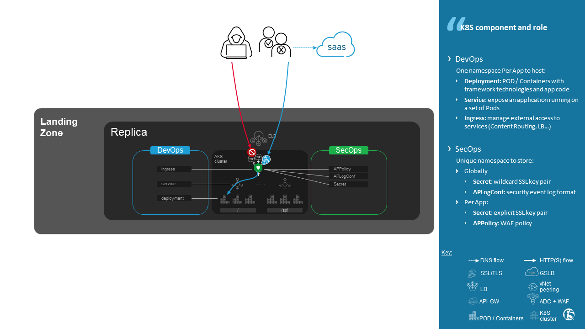
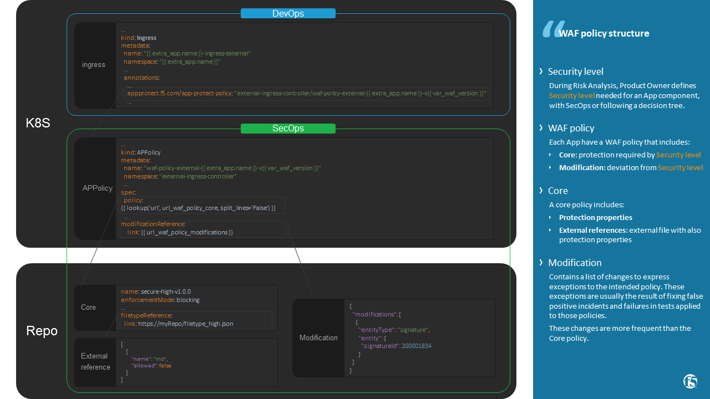

Enable NGINX App Protect as Ingress for Azure Kubernetes Services (AKS)
=======================================================================
.. contents:: Table of Contents

Introduction
==================================================
Use Case
###############
- **Security** -- Publish and Secure your applications with a Web Application Firewall (WAF)
- **Organization** -- Delegate App publication to DevOps and WAF policies to SecOps
- **Automation** -- Automate use cases:

A) [SecOps] **Deploy Ingress Controller** -- SecOps deploy K8S Ingress with an embedded WAF
B) [SecOps] **Deploy App certificate** -- SecOps deploy per App security objects (Secret/SSL key pair)
C) [DevOps] **Publish an Application** -- DevOps deploy Applications by selecting a pre-defined security level
D) [SecOps] **Update WAF policy attached to a security level** -- The threat evolves, SecOps adapts WAF strategy to protect capital asset: application
E) [SecOps] **Fix false positive** -- SecOps modify a application's WAF policy to fix a False Positive that impact User Experience
F) [DevOps] **Secure published API** -- Limit the attack surface by allow access to only compliant API call. DevOps regularly update OpenAPI specifications of an App.
G) [SecOps] **Update signatures** -- SecOps do rolling upgrade of NGINX Ingress Controller images with up to date protection engine and signatures.

Benefit
###############
- **Security** -- protect globally from threats and manage False Positive per Application to reach Service Level Objective and so satisfy User Experience
- **Organization** -- In a blameless culture, clear responsibility between DevOps and SecOps creates strong collaboration
- **Security Service Catalog** -- Managed Security objects by SecOps are ready to be consumed by DevOps
- **Automation** -- Asynchronous deployment operations between DevOps and SecOps does not delayed app's time to market

Architecture
###############
Functional view
*********************
In this demo, functional components in the data path between Application code and consumers are:

- **GSLB** -- Make fastest DNS resolution and redirect users to closest App's Point of Presence. DNS anti-DDoS included.
- **WAF** -- Adapt asset (App's component or micro-service) protection regarding its value and threat risk. Protection features are:
- **+-- Reduce attack surface**: Publish the strict necessary of API apps using up to date `openAPI spec file (swagger) <https://swagger.io/specification/>`_
- **+-- Virtual Patching**: block exploitation of vulnerabilities (`CVE <https://cve.mitre.org/>`_) on underlying App's technologies / framework (Apache, Django, Postgre SQL...)
- **+-- Weakness in code**: Following awareness of OWASP foundation for `Web app <https://owasp.org/www-project-top-ten/>`_ and `API app <https://owasp.org/www-project-api-security/>`_, raise protection to `prevent from hacking actions <http://veriscommunity.net/enums.html#section-actions>`_
- **+-- Threat Campaign**: Because patient zero are honey pots, obtain associated attack signatures against 0-day from `Application Threat Intelligence <https://www.f5.com/labs/application-protection>`_
- **K8S Ingress / Content routing** -- Route and load balance traffic to PODs hosted on Kubernetes

.. figure:: _figures/NIC_functionnal_view.png

Product
*********************
Products used for this demo:

- **GSLB**: `F5 Cloud Services <https://simulator.f5.com/>`_
- **WAF**: `NGINX App Protect <https://www.nginx.com/products/nginx-app-protect/>`_
- **K8S Ingress / Content routing**: `NGINX Ingress Controller <https://www.nginx.com/products/nginx/kubernetes-ingress-controller/>`_
- **K8S**: Azure Kubernetes Services (AKS)
- **Image Registry**: Azure Container Registry (ACR)
- **WAF policy repository**: GitHub
- **Automation tool**: Ansible Tower

Network view
*********************
- **Azure External Load Balancer**: L3 router that Load Balances and Destination NAT (Public > Private) traffic to Ingress
- **NGINX Ingress Controller**: L7 reverse-proxy that redirect + Load Balances traffic to PODs regarding its Content Routing policy

Kubernetes view
*********************
Administrative segmentation between DevOps and SecOps is done by associating k8s object to related owner *namespace*

WAF policy structure
*********************
- **Security level**: During Risk Analysis, Product Owner defines Security level needed for an App component, with SecOps or following a decision tree.
- **WAF policy**: Each App have a WAF policy that includes:
- **+-- Core**: protection required by Security level
- **+-- Modification**: deviation from Security level
- **Core**: A core policy includes:
- **+-- Protection properties**
- **+-- External references**: external file with also protection properties
- **Core**: A core policy includes:
- **Modification**: Contains a list of changes to express exceptions to the intended policy. These exceptions are usually the result of fixing false positive incidents and failures in tests applied to those policies. These changes are more frequent than the Core policy.

More details `here <https://docs.nginx.com/nginx-app-protect/configuration/#policy-authoring-and-tuning>`_.

Demo
###############
A) [SecOps] Deploy Ingress Controller
*********************

:kbd:`ToDo`

B) [SecOps] Deploy App certificate
*********************

:kbd:`ToDo`

C) [DevOps] Publish an Application
*********************

:kbd:`ToDo`

D) [SecOps] Update WAF policy attached to a security level
*********************

:kbd:`ToDo`

E) [SecOps] Fix false positive
*********************

:kbd:`ToDo`

F) [DevOps] Secure published API
*********************

:kbd:`ToDo`

G) [SecOps] Update signatures
*********************

:kbd:`ToDo`

- Automate an Application deployment
.. raw:: html

    

Pre-requisites
==============
Ansible Tower
##############
virtualenv
***************************
- Create a virtualenv following `this guide <https://docs.ansible.com/ansible-tower/latest/html/upgrade-migration-guide/virtualenv.html>`_
- In virtualenv, as a prerequisite for Azure collection, install Azure SDK following `this guide <https://github.com/ansible-collections/azure>`_
- In virtualenv, as a prerequisite for K8S collection, install ``openshift`` following `this guide <https://github.com/ansible-collections/community.kubernetes>`_
- In virtualenv, fix an issue during ``openshift`` installation ``google`` package dependency:

.. code:: bash

    $ vi /var/lib/awx/venv/myVirtualEnv/lib/python2.7/site-packages/google/__init__.py
    $ <copy paste https://raw.githubusercontent.com/googleapis/google-auth-library-python/master/google/__init__.py>

Helm
***************************
Install Helm following `this guide <https://helm.sh/docs/intro/install/>`_

.. code:: bash

    $ curl https://raw.githubusercontent.com/helm/helm/master/scripts/get-helm-3 | bash

Project
***************************
- Clone this repository to a private repo. A private repo is needed because a ``kubeconfig`` file will be store in ``playbooks/roles/poc-k8s/files``
- Create a project following `this guide <https://docs.ansible.com/ansible-tower/latest/html/userguide/projects.html>`_

Credential
***************************
- Create a Service Principal on Azure following `this guide <https://docs.microsoft.com/en-us/azure/active-directory/develop/quickstart-register-app>`_
- Create a Microsoft Azure Resource Manager following `this guide <https://docs.ansible.com/ansible-tower/latest/html/userguide/credentials.html#microsoft-azure-resource-manager>`_
- Create Credentials ``cred_jumphost`` for Jumphost tasks following `this guide <https://docs.ansible.com/ansible-tower/latest/html/userguide/credentials.html#machine>`_

=====================================================   =============================================   =============================================   =============================================   =============================================
REDENTIAL TYPE                                          USERNAME                                        SSH PRIVATE KEY                                 SIGNED SSH CERTIFICATE                          PRIVILEGE ESCALATION METHOD
=====================================================   =============================================   =============================================   =============================================   =============================================
``Machine``                                             ``my_VM_admin_user``                            ``my_VM_admin_user_key``                        ``my_VM_admin_user_CRT``                        ``sudo``
=====================================================   =============================================   =============================================   =============================================   =============================================

Ansible role structure
######################
- Deployment is based on ``workflow template``. Example: ``workflow template`` = ``wf-create_create_edge_security_inbound``
- ``workflow template`` includes multiple ``job template``. Example: ``job template`` = ``poc-azure_create_hub_edge_security_inbound``
- ``job template`` have an associated ``playbook``. Example: ``playbook`` = ``playbooks/poc-azure.yaml``
- ``playbook`` launch a ``play`` in a ``role``. Example: ``role`` = ``poc-azure``

.. code:: yaml

    - hosts: localhost
      gather_facts: no
      roles:
        - role: poc-azure

- ``play`` is an ``extra variable`` named ``activity`` and set in each ``job template``. Example: ``create_hub_edge_security_inbound``
- The specified ``play`` (or ``activity``) is launched by the ``main.yaml`` task located in the role ``tasks/main.yaml``

.. code:: yaml

    - name: Run specified activity
      include_tasks: "{{ activity }}.yaml"
      when: activity is defined

- The specified ``play`` contains ``tasks`` to execute. Example: play=``create_hub_edge_security_inbound.yaml``

0) [DevOps] Deploy AKS infrastructure
==================================================
Create and launch a workflow template ``wf-aks-create-infra`` that includes those Job templates in this order:

=============================================================   =============================================       =============================================   =============================================   =============================================   =============================================   =============================================
Job template                                                    objective                                           playbook                                        activity                                        inventory                                       limit                                           credential
=============================================================   =============================================       =============================================   =============================================   =============================================   =============================================   =============================================
``poc-azure_create-spoke-aks``                                  Create Ressource Group and vNet                     ``playbooks/poc-azure.yaml``                    ``create-spoke-aks``                                                                                                                            ``my_azure_credential``
``poc-aks_create-registry``                                     Create ACR                                          ``playbooks/poc-aks.yaml``                      ``create-registry``                                                                                                                             ``my_azure_credential``
``poc-aks_create-cluster``                                      Create AKS                                          ``playbooks/poc-aks.yaml``                      ``create-cluster``                                                                                                                              ``my_azure_credential``
``poc-azure_create-vm-jumphost``                                Create Jumphost                                     ``playbooks/poc-azure.yaml``                    ``create-vm-jumphost``                                                                                                                          ``my_azure_credential``
=============================================================   =============================================       =============================================   =============================================   =============================================   =============================================   =============================================

==============================================  =============================================   ================================================================================================================================================================================================================
Extra variable                                  Description                                     Example
==============================================  =============================================   ================================================================================================================================================================================================================
``extra_platform_name``                         name used for resource group, vNet...           ``aksdistrict``
``extra_location``                              Azure region                                    ``eastus2``
``extra_platform_tags``                         Object tags                                     ``environment=DMO project=CloudBuilderf5``
``extra_hub_name``                              used to create vNet peering with a HUB          ``HubInbound``
``extra_vnet_address_prefixes``                 vNet CIDR                                       ``10.13.0.0/16``
``extra_management_subnet_address_prefix``      Management subnet that hosts juphost            ``10.13.0.0/24``
``extra_zone_subnet_address_prefix``            K8S Nodes and PODs subnet ; Azure CNI used      ``10.13.1.0/24``
``extra_zone_name``                             K8S Nodes and PODs subnet ; Azure CNI used      ``cni-nodesandpods``
``extra_service_cidr``                          K8S internal service subnet                     ``10.200.0.0/24``
``extra_dns_service_ip``                        K8S internal DNS service subnet                 ``10.200.0.10``
``extra_k8s_version``                           K8S version                                     ``1.19.0``
``extra_admin_username``                        K8S admin user of jumphost                      ``PawnedAdmin``
``extra_admin_ssh_crt``                         K8S public key of admin user                    ``ssh-rsa ...``
``extra_app_vm_size``                           K8S VMSS / node VM size                         ``Standard_DS1_v2``
``extra_sp_client_id``                          Service Principal / client ID                   ``<UUID>>``
``extra_sp_client_secret``                      Service Principal / client Secret               ``...``
``extra_jumphost``                              properties of jumphost                          dict, see below
==============================================  =============================================   ================================================================================================================================================================================================================

.. code:: yaml

    extra_jumphost:
      name: jumphost
      vm_size: Standard_DS1_v2
      private_ip: 10.13.0.10
      acl_src_ips:
        - '10.0.0.0/8'
      ssh_crt: "-----BEGIN CERTIFICATE-----...-----END CERTIFICATE-----"

A) [SecOps] Deploy Ingress Controller
==================================================
Pre-requisites
###############################
NGINX licence
***************************
Download your NGINX+ licence files ``nginx-repo.crt`` and ``nginx-repo.key`` to your private repository ``/playbooks/roles/poc-k8s/files/``

AKS - kubeconfig
***************************
- Connect to Azure console

.. code:: bash

    $ az aks get-credentials --resource-group rg-<platform_name> --name CloudBuilder

- Download your kubeconfig file ``~/.kube/config`` to your private repository ``/playbooks/roles/poc-k8s/files/config.yaml``

ACR - token
***************************
- Connect to Azure console

.. code:: bash

    $ az acr login --name cloudbuilder.azurecr.io --expose-token

- Get a repository ``accessToken`` to be authorized to push NGINX Controller image to ACR

Workflow
###############################
Create and launch a workflow template ``wf-k8s-create-ingress-controller`` that includes those Job templates in this order:

=============================================================   =============================================       =============================================   =============================================   =============================================   =============================================   =============================================
Job template                                                    objective                                           playbook                                        activity                                        inventory                                       limit                                           credential
=============================================================   =============================================       =============================================   =============================================   =============================================   =============================================   =============================================
``poc-aks_get-registry_info``                                   Get login_server info                               ``playbooks/poc-aks.yaml``                      ``get-registry_info``                                                                                                                           ``my_azure_credential``
``poc-azure_get-vm-jumphost``                                   Get FQDN jumphost info                              ``playbooks/poc-azure.yaml``                    ``get-vm-jumphost``                                                                                                                             ``my_azure_credential``
``poc-k8s-create_nginx_ic_image``                               Build and push NGINX IC + App Protect               ``playbooks/poc-k8s_jumphost.yaml``             ``create_nginx_ic_image``                       localhost                                                                                       ``cred_jumphost``
``poc-k8s-deploy_nginx_ic``                                     Create or update Ingress container instances        ``playbooks/poc-k8s.yaml``                      ``deploy_nginx_ic``                             localhost
=============================================================   =============================================       =============================================   =============================================   =============================================   =============================================   =============================================

==============================================  =============================================   ================================================================================================================================================================================================================
Extra variable                                  Description                                     Example
==============================================  =============================================   ================================================================================================================================================================================================================
``extra_platform_name``                         name used for resource group, vNet...           ``aksdistrict``
``extra_nginx_ic_version``                      NGINX Ingress Controller version                ``1.9.0``
``extra_ilb_ingress_ip``                        Azure ILB VIP for Internal Ingress              ``eastus2``
``extra_jumphost``                              properties of jumphost                          dict, see below
``extra_acr_token``                             ACR token                                       survey entry, text type
``extra_wildcard_tls_crt``                      Default wildcard certificate                    survey entry, textarea type
``extra_wildcard_tls_key``                      Default wildcard private key                    survey entry, textarea type
==============================================  =============================================   ================================================================================================================================================================================================================

.. code:: yaml

    extra_jumphost:
      name: jumphost

B) [SecOps] Deploy App certificate
==================================================
Create and launch a workflow template ``wf-k8s-deploy-secret_ssl`` that includes those Job templates in this order:

=============================================================   =============================================       =============================================   =============================================   =============================================   =============================================   =============================================
Job template                                                    objective                                           playbook                                        activity                                        inventory                                       limit                                           credential
=============================================================   =============================================       =============================================   =============================================   =============================================   =============================================   =============================================
``poc-k8s-deploy_ssl``                                          Create a SSL key pair                               ``playbooks/poc-k8s.yaml``                      ``deploy_ssl``                                  localhost
=============================================================   =============================================       =============================================   =============================================   =============================================   =============================================   =============================================

==============================================  =============================================   ================================================================================================================================================================================================================
Extra variable                                  Description                                     Example
==============================================  =============================================   ================================================================================================================================================================================================================
``extra_app``                                   App properties                                  dict, see below
``extra_app_name``                              App hostname                                    survey, text type
``extra_app_tls_crt``                           App SSL certificate                             survey, textarea type
``extra_app_tls_key``                           App SSL private key                             survey, textarea type
==============================================  =============================================   ================================================================================================================================================================================================================

.. code:: yaml

    extra_app:
      domain: f5app.dev

C) [DevOps] Publish an Application
==================================================
Pre-requisites
###############################
ACR - token
***************************
- Connect to Azure console

.. code:: bash

    $ az acr login --name cloudbuilder.azurecr.io --expose-token

- Get a repository ``accessToken`` to be authorized to push NGINX Controller image to ACR

Workflow
###############################
Create and launch a workflow template ``wf-k8s-publish-app`` that includes those Job templates in this order:

=============================================================   =============================================       =============================================   =============================================   =============================================   =============================================   =============================================
Job template                                                    objective                                           playbook                                        activity                                        inventory                                       limit                                           credential
=============================================================   =============================================       =============================================   =============================================   =============================================   =============================================   =============================================
``poc-aks_get-registry_info``                                   Get login_server info                               ``playbooks/poc-aks.yaml``                      ``get-registry_info``                                                                                                                           ``my_azure_credential``
``poc-azure_get-vm-jumphost``                                   Get FQDN jumphost info                              ``playbooks/poc-azure.yaml``                    ``get-vm-jumphost``                                                                                                                             ``my_azure_credential``
``poc-k8s-create_app_image``                                    Build and push micro-services images                ``playbooks/poc-k8s_jumphost.yaml``             ``create_app_image``                            localhost                                                                                       ``cred_jumphost``
``poc-k8s-deploy_app``                                          Deploy App, Services and Ingress                    ``playbooks/poc-k8s.yaml``                      ``deploy_app``                                  localhost
``poc-k8s-deploy_gslb``                                         Deploy GSLB                                         ``playbooks/poc-k8s.yaml``                      ``deploy_gslb``                                 localhost
=============================================================   =============================================       =============================================   =============================================   =============================================   =============================================   =============================================

==============================================  =============================================   ================================================================================================================================================================================================================
Extra variable                                  Description                                     Example
==============================================  =============================================   ================================================================================================================================================================================================================
``extra_platform_name``                         name used for resource group, vNet...           ``aksdistrict``
``extra_elk``                                   Security log collector                          ``10.13.0.10``
``extra_app``                                   App properties                                  dict, see below
``extra_cs``                                    F5 Cloud Services credentials                   dict, see below
``extra_jumphost``                              properties of jumphost                          dict, see below
``extra_acr_token``                             ACR token                                       survey, text type
``extra_app_swagger_url``                       swagger file repo URI                           survey, text type; 'none' == no API Security
``extra_waf_policy_level``                      Security level                                  survey, multiple choice type: low, medium, high
==============================================  =============================================   ================================================================================================================================================================================================================

.. code:: yaml

    extra_app:
      name: arcadia
      domain: f5app.dev
      gslb_location:
        - eu
      components:
        - name: main
          location: /
          source_image: 'https://gitlab.com/arcadia-application/main-app.git'
        - name: app2
          location: /api
          source_image: 'https://gitlab.com/arcadia-application/app2.git'
          swagger_url: none
        - name: app3
          location: /app3
          source_image: 'https://gitlab.com/arcadia-application/app3.git'
        - name: backend
          location: /files
          source_image: 'https://gitlab.com/arcadia-application/back-end.git'

.. code:: yaml

    extra_cs:
      username: name@acme.com
      password: ...
      hostname: api.cloudservices.f5.com
      api_version: v1

.. code:: yaml

    extra_jumphost:
      name: jumphost

D) [SecOps] Update WAF policy attached to a security level
==================================================
Raise webhook after a ``pull request`` is done on WAF policies repository

Workflow
###############################
Create and launch a workflow template ``wf-k8s-fetch-waf-policies`` that includes those Job templates in this order:

=============================================================   =============================================       =============================================   =============================================   =============================================   =============================================   =============================================
Job template                                                    objective                                           playbook                                        activity                                        inventory                                       limit                                           credential
=============================================================   =============================================       =============================================   =============================================   =============================================   =============================================   =============================================
``poc-k8s-reload_ingress``                                      Reload NGINX Ingress Controller                     ``playbooks/poc-k8s.yaml``                      ``deploy_app``                                  localhost
=============================================================   =============================================       =============================================   =============================================   =============================================   =============================================   =============================================

Webhook
***************************
- Clone `WAF policies repository <https://github.com/nergalex/f5-nap-policies>`_  to a new repo
- Create a Webhook following `this guide <https://docs.ansible.com/ansible-tower/latest/html/userguide/webhooks.html>`_

E) [SecOps] Fix false positive
==================================================
Raise webhook after a ``pull request`` is done on WAF policies repository
Execute step (D).

F) [DevOps] Secure published API
==================================================
Execute step (C) setting ``extra_app.components.2.swagger_url`` value with ``https://github.com/nergalex/f5-nap-policies/blob/master/policy/open-api-files/arcadia.f5app.dev.yaml``

E) [SecOps] Fix false positive
==================================================
Execute step (A).

Troubleshoot
==================================================
Get External Ingress Controller PODs:

:kbd:`kubectl describe pod --namespace external-ingress-controller`

View Ingress Controller status (Cache, Zones, Upstream servers) from Jumphost:

:kbd:`http://Pod_IP:8080/dashboard.html`

Get error logs from an External Ingress Controller POD:

:kbd:`kubectl logs --namespace external-ingress-controller POD_name`

Launch a shell on an External Ingress Controller POD:

:kbd:`kubectl exec --namespace external-ingress-controller -it POD_name sh`

View WAF policies for App 'arcadia':

:kbd:`kubectl describe --namespace external-ingress-controller --selector 'app==arcadia' APPolicy`

View App's Service:

:kbd:`kubectl get svc --namespace arcadia -owide`

View App's Ingress:

:kbd:`kubectl get ingress --namespace arcadia -owide`

Reference
==================================================
- `F5 attack signature info <https://clouddocs.f5.com/cloud-services/latest/f5-cloud-services-Essential.App.Protect-Details.html#attack-signatures>`_
- `AWS NGINX eXperience <http://aws.nginx-experience.com>`_
- `NGINX Ingress Controller - HELM <https://docs.nginx.com/nginx-ingress-controller/installation/installation-with-helm/#configuration>`_
- `NGINX Ingress Controller - snippet <https://docs.nginx.com/nginx-ingress-controller/configuration/ingress-resources/advanced-configuration-with-snippets/>`_
- `NGINX Ingress Controller - App Protect annotation <https://docs.nginx.com/nginx-ingress-controller/configuration/ingress-resources/advanced-configuration-with-annotations/#app-protect>`_
- `NGINX Ingress Controller - Minions <https://github.com/nginxinc/kubernetes-ingress/tree/master/examples/mergeable-ingress-types>`_
